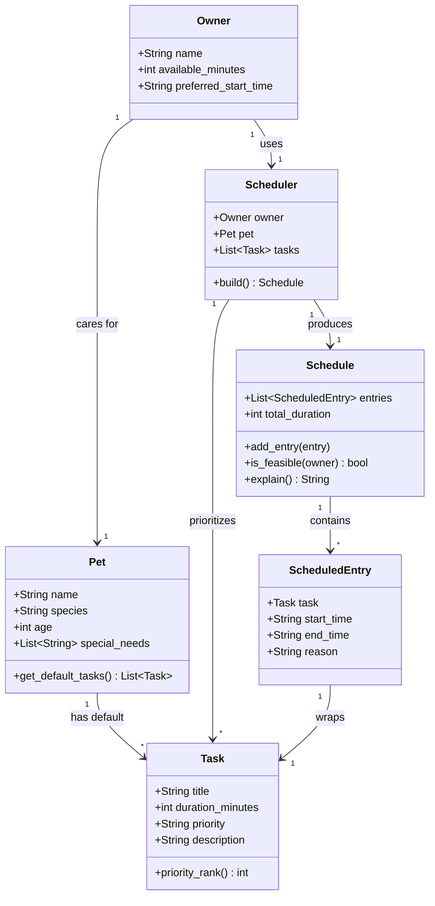

# PawPal+ UML Class Diagram

```mermaid
classDiagram
    class Task {
        +String title
        +int duration_minutes
        +String priority
        +String description
        +priority_rank() int
    }

    class ScheduledEntry {
        +Task task
        +String start_time
        +String end_time
        +String reason
    }

    class Pet {
        +String name
        +String species
        +int age
        +List~String~ special_needs
        +get_default_tasks() List~Task~
    }

    class Owner {
        +String name
        +int available_minutes
        +String preferred_start_time
    }

    class Schedule {
        +List~ScheduledEntry~ entries
        +int total_duration
        +add_entry(entry)
        +is_feasible(owner) bool
        +explain() String
    }

    class Scheduler {
        +Owner owner
        +Pet pet
        +List~Task~ tasks
        +build() Schedule
    }

    Owner "1" --> "1" Pet : cares for
    Owner "1" --> "1" Scheduler : uses
    Pet "1" --> "*" Task : has default
    Scheduler "1" --> "*" Task : prioritizes
    Scheduler "1" --> "1" Schedule : produces
    Schedule "1" --> "*" ScheduledEntry : contains
    ScheduledEntry "1" --> "1" Task : wraps
```
