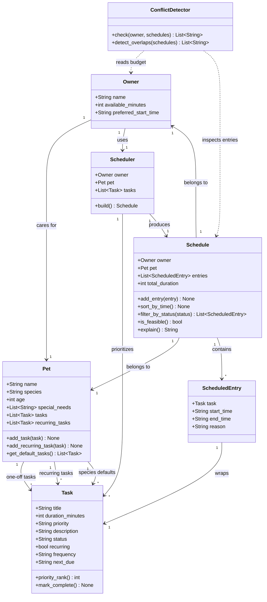

# PawPal+ UML Class Diagram

## What changed from Phase 1

**`Task`** — added `status`, `recurring`, `frequency`, and `next_due` fields to support
completion tracking and auto-recurrence. Added `mark_complete()` which advances `next_due`
via `timedelta` when `frequency` is set.

**`Pet`** — added two task lists (`tasks` for one-off, `recurring_tasks` for daily/weekly
habits) and the methods to populate them. The original diagram only showed species defaults.

**`Schedule`** — added `sort_by_time()` (sorts entries by HH:MM start time) and
`filter_by_status()` (returns a filtered subset of entries by task status).

**`ConflictDetector`** — new class, not in the original design. Provides two checks:
`check()` for budget overruns across multiple pets, and `detect_overlaps()` for
time-window collisions between any two scheduled entries.

**Relationships** — `Pet --> Task` is now three distinct arrows (one-off, recurring,
species defaults) instead of a single "has default" edge. `ConflictDetector` uses dashed
dependency arrows (`..>`) to `Owner` and `Schedule` since it reads them without owning them.
